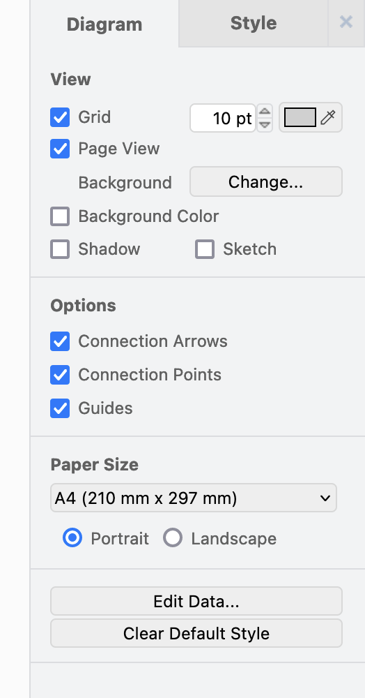
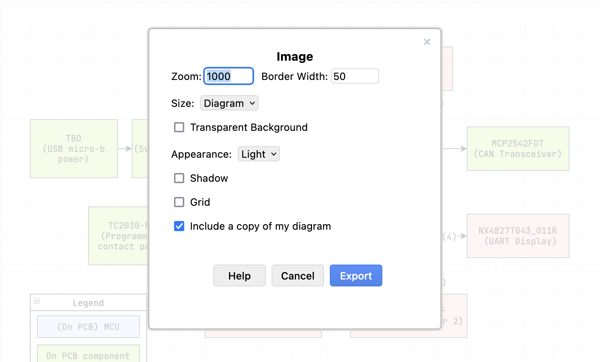

# Flow Diagram .drawio Conventions

---

<details markdown="1">
  <summary>Table of Contents</summary>

- [1 Overview of .drawio](#1-overview-of-drawio)
- [2 Diagram Document Settings](#2-diagram-document-settings)
- [3 Collaboration Via Google Drive](#3-collaboration-via-google-drive)
- [4 Pages](#4-pages)
- [5 Layers](#5-layers)
- [6 Custom Links](#6-custom-links)
- [7 Exporting](#7-exporting)
    - [7.1 PNG](#71-png)
- [8 Shortcuts](#8-shortcuts)

</details>

---

## 1 Overview of .drawio

`.drawio` files are used for documentation when creating pictures of flowcharts,
block diagrams, etc.

The most recommended tool is to use [drawio.com](https://www.drawio.com/), or
more specifically more directly [app.diagrams.net](https://app.diagrams.net/).

This document outlines the general configurations and practices to be followed
as convention.

---

## 2 Diagram Document Settings

Use the following diagram document settings:

```
Grid = 10 pt
Paper Size = A4
```

<details markdown="1">
  <summary>Reference Image</summary>

</details>

---

## 3 Collaboration Via Google Drive

Standard conventions are to collaborate using Google Drive. Drawio builds ontop
of Google Drive allowing it to take advantage of Google Drive's many features.

This setup allows for a Google Docs like collaboration experience, including:
seamless file share, live document updates, and visible / shared mouse cursors.

> [Collaborate on and share diagrams online](https://www.drawio.com/doc/faq/share-diagrams)

---

## 4 Pages

Pages are used similar to any notebook, ideally this is used to separate key
concepts, subsystems and more.

> [Add a page to a diagram](https://www.drawio.com/doc/faq/page-add)

---

## 5 Layers

Layers should be used appropriate according to each document's function /
purpose. Layers are primarily used to separate diagram components. Also,
consider that layers can also be linked using the custom links feature.

> [Work with layers in draw.io](https://www.drawio.com/doc/layers)

---

## 6 Custom Links

Custom links can be used for clickable redirects to diagram elements, pages, and
layers. These are an extremely powerful feature, similar to electrical
schematics with subsystem redirects.

> [Work with custom links](https://www.drawio.com/doc/faq/custom-links)

---

## 7 Exporting

At the conclusion of a project or distribution with external parties, exporting
to a different file format may be beneficial / required.

### 7.1 PNG



```
Zoom = 1000
Border Width = 50
Size = Diagram
Transparent Background = FALSE
Appearance = Light
Shadow = FALSE
Grid = FALSE
Include a copy of my diagram = TRUE
```

---

## 8 Shortcuts

> [draw.io shortcuts](https://www.drawio.com/blog/shortcuts)
