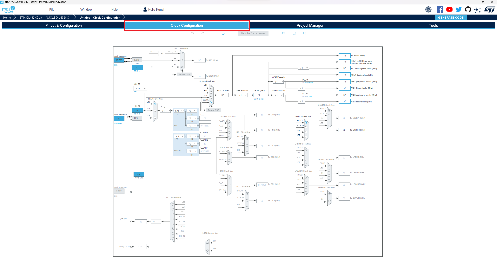
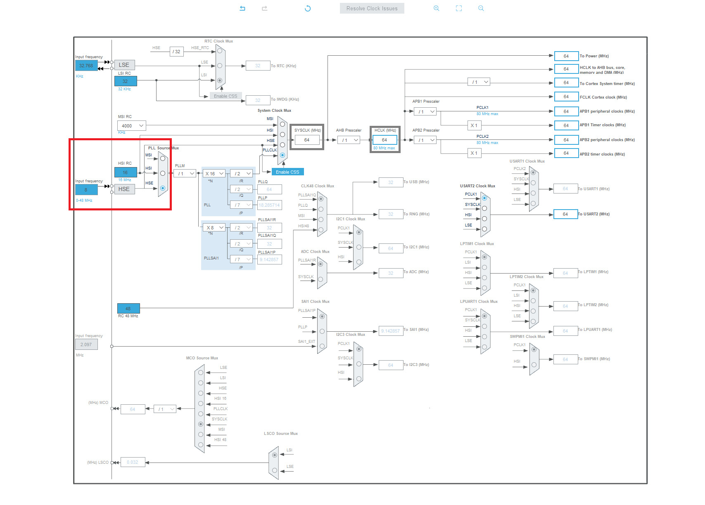
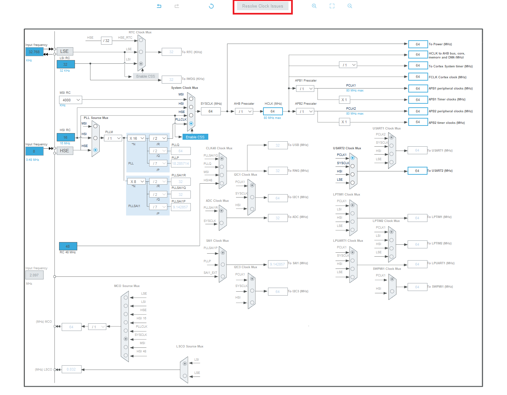
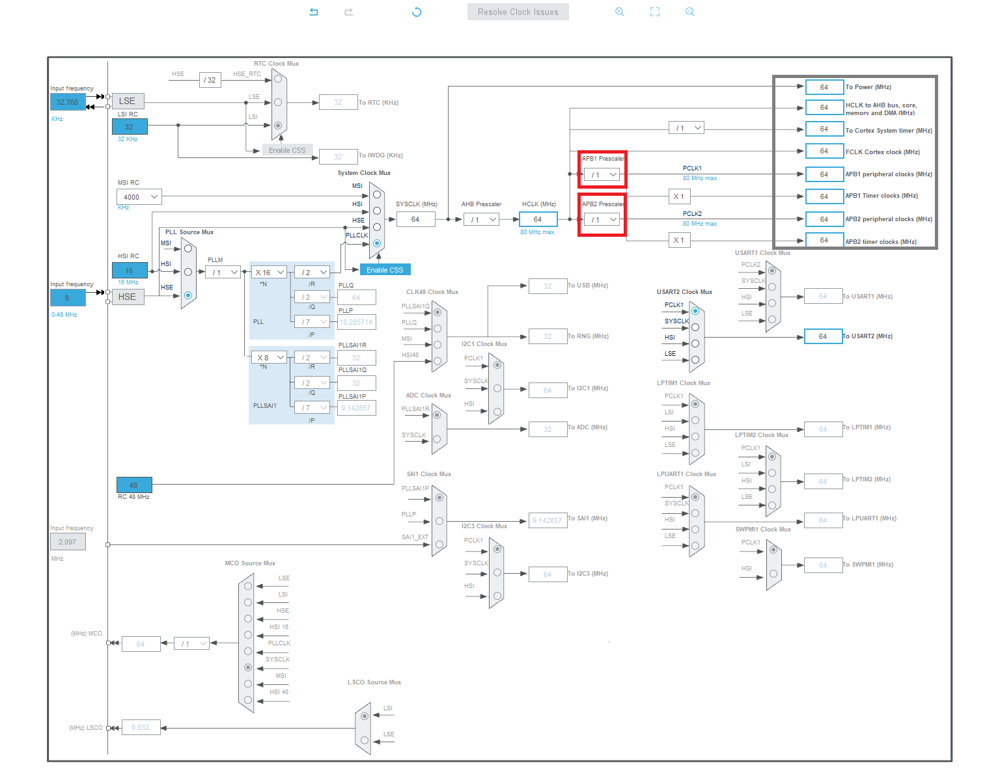

# STM32CubeMX Clock Configuration

## `.ioc` Configuration

- Configure Clock In STM32CubeMX

## STM32CubeMX Screenshots

1) Navigate to Clock Configurations in your project using the tabs at the top of the interface. 

2) Change input frequency mux (sideways trapaziod) to HSE (High Speed External). This will change the SYSCLK and HCLK (grey boxes).

3) If any boxes turn red, click on the resolve clock issues box. 

4) Use the APB prescalers (red box) to manipulate the output frequencies of the peripherals (grey box). 

