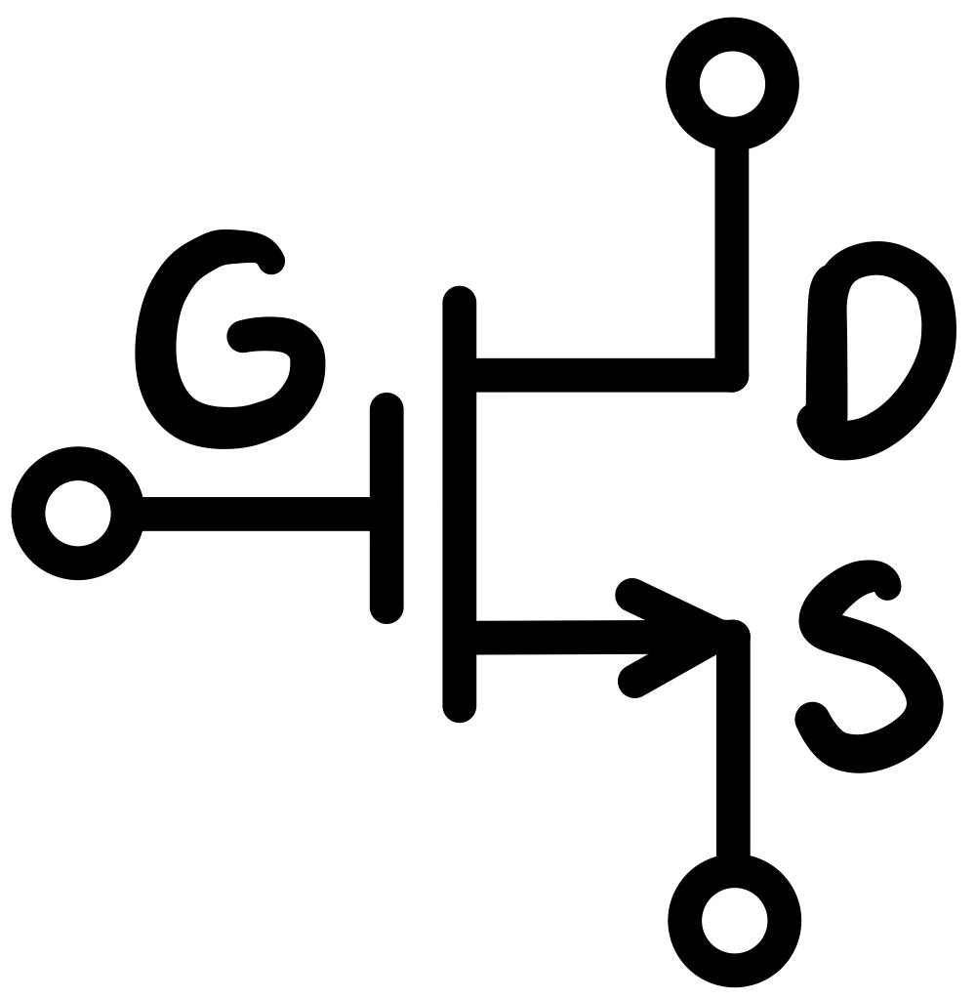
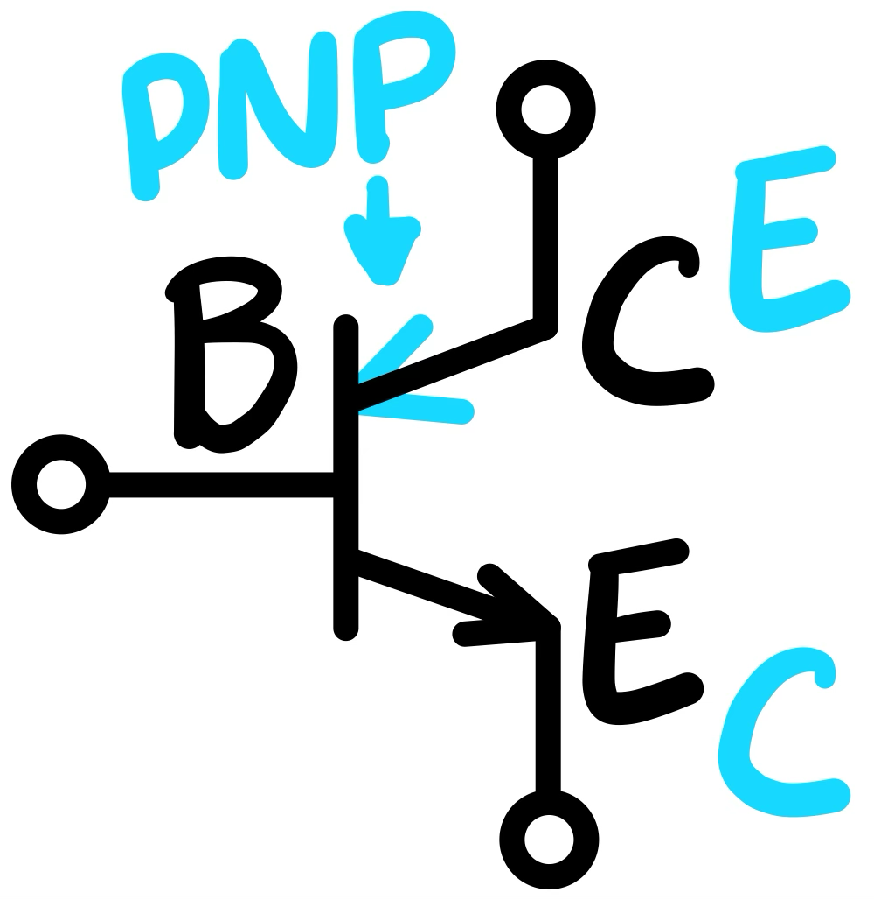

# Circuits and Electronics

---

  
Table of Contents

-

---

## Introduction

Recommended resources:

Online public
textbooks: [All About Circuits](https://www.allaboutcircuits.com/textbook/)

(Paid)
Textbook: [Sedra Smith Microelectronic Circuits](https://learninglink.oup.com/search/Sedra%20Smith%20Microelectronic%20Circuits?discipline=Engineering)

---

## Intro to Circuits and Electronics

---

## Ohms Law

---

| Quanity    | Symbol | Unit of Measurement |
|------------|:------:|:-------------------:|
| Current    |   I    |     Ampere (A)      |
| Voltage    |   V    |      Volt (V)       |
| Resistance |   R    |       Ohm (Ω)       |

- The unit of resistance is ohms (1Ω = V/A).
- Ohm's law says that the current through a conductor is given by the following;
  $I = \frac{V}{R}$.
- Where V is the voltage across a conductor.

## KVL KCL

### Kirchhoff’s Voltage Law (KVL)

##### In a Series Circuit

- The algebraic sum of all voltages in loop must equal zero.
    - $V_{total} = V_{1} + V_{2} + V_{3} + ...V_{n}$.

##### In a Parallel Circuit

- The voltage across every resistor is the same as the supply voltage.
    - $V_{total} = V_{1} = V_{2} = V_{3} = ...V_{n}$.

### Kirchhoff's Current Law (KCL)

##### Parallel  Circuit

- The algebraic sum of all currents entering and exiting a node must equal zero.
- The total current in a parallel circuit must equal the sum of the branch
  currents.
    - $I_{in} = I_{out}$.

---

## Voltage Divider

---

## Node and Mesh Analysis

---

## Thevenin and Norton

Conversions:

- $R_{Th} = R_{N}$.
- $V_{Th} = I_{N} \times R_{N}$.
- $I_{N} = \frac{V_{Th}}{R_{Th}}$.

### Thevenin

Voltage source series to resistor.

### Norton

Current source parallel to resistor.

---

## Source transform

---

## Superposition

---

## Diodes

Shockley diode
equation: $I_{D} = I_{S} \left( e^{\frac{V_{D}}{nV_{T}}} - 1 \right)$.

- $I_{D}$ = Diode current.
- $I_{S}$ = Reverse bias saturation current.
- $V_{D}$ = Voltage across the diode.
- $V_{T}$ = Thermal voltage.
    - Where $V_{T} = \frac{kT}{q}$.
      -
      $k$ = [Boltzmann constant](https://en.wikipedia.org/wiki/Boltzmann_constant).
        - $T$ = Absolute temperature $K$.
        - $q$ = Magnitude of an electron's charge,
          aka [elementary charge](https://en.wikipedia.org/wiki/Elementary_charge)
          $C$.

$n$ = [Ideality / quality factor](https://en.wikipedia.org/wiki/Ideality_factor)
or emission coefficient.

---

## Operational Amplifier (Op Amp)

### Gain

Gain: $A = \frac{output}{input}$.

Voltage gain: $A_{v} = \frac{v_{output}}{v_{input}}$.

---

## DC and AC Signal Analysis

### DC Analysis

Important aspects to remember:

1. Signal / AC sources are short.
2. Coupling / decoupling / bypass capacitors are open.

### AC (Small Signal) Analysis

Important aspects to remember:

1. DC sources are short.
2. Coupling / decoupling / bypass capacitors are short.
3. Transistors (BJT, MOSFET, etc.) operate to their small signal model.
4. Transistors require bias currents to find small signal model parameters.

---

## Metal Oxide Field Effect Transistor (MOSFET)

For an ideal MOSFET, the gate current is essentially zero. The gate is insulated
from the channel by a thin layer of oxide, and no direct current flows through
the gate. This insulation makes the MOSFET a voltage-controlled device.

Therefore, the current relationship in an NMOS under normal operation, assuming
no substrate (body) current, is $I_{D} = I_{S}$, since $I_{G} = 0$.

MOSFETs are driven by current as its control signal input.

### Operating Mode / Response Region

| NPN Configuration                  | Input | Control Signal Input | Output |
|------------------------------------|-------|----------------------|--------|
|  | Drain | Gate                 | Source |

| Operating Mode |               Characteristics               | Application |
|----------------|:-------------------------------------------:|:-----------:|
| Cutoff         |              $v_{GS} < V_{t}$               |  Digital 0  |
| Triode         |    $v_{GD} > V_{t}$ or $v_{OV} > V_{DS}$    |  Digital 1  |
| Saturation     | $v_{GD} \leq V_{t}$ or $v_{OV} \leq V_{DS}$ |  Amplifier  |

- $V_{t}$ = Threshold voltage.
- $V_{OV}$ = Over voltage, $V_{OV} = v_{GS} - V_{t}$.

### I-V Relationship

| Operating Mode |                                             I-V relationship                                              |
|----------------|:---------------------------------------------------------------------------------------------------------:|
| Cutoff         |                                                $i_{D} = 0$                                                |
| Triode         | $i_{D} = k_{n}' \frac{W}{L} \left( \left( v_{GS} - V_{t} \right) v_{DS} - \frac{1}{2} v^{2}_{DS} \right)$ |
| Saturation     |                $i_{D} = \frac{1}{2} k_{n}' \frac{W}{L} \left( v_{GS} - V_{t} \right)^{2}$                 |

- Where $k_{n}' = \mu_{n} C_{ox}$ and $k_{n} = k_{n}' \frac{W}{L}$.
- $\mu_{n}$ = Electronic mobility of N-type $Cm^2 / Vs$.
- $C_{ox}$ = Oxide capacitance $fF / \mu m^{2}$.
- $W$ = Channel width.
- $L$ = Channel length.

### Small Signal Analysis (AC)

Signal model parameters:

$g_{m} = \frac{2 I_{D}}{V_{OV}}$.

#### T Model & Hybrid Pi Model

Dependant current: $i_{D} = g_{m} v_{GS}$.

Resistance: $r_{o} = \infty$.

### Amplifier Applications

Recall, the MOSFET must operate in saturation mode.

|                       |                  Common Source                  |                                          Common Source with Source Resistor                                          |                  Common Gate                   |            Common Drain            |
|-----------------------|:-----------------------------------------------:|:--------------------------------------------------------------------------------------------------------------------:|:----------------------------------------------:|:----------------------------------:|
| Model                 |                    Hybrid Pi                    |                                                          T                                                           |                       T                        |                 T                  |
| Input                 |                      Gate                       |                                                         Gate                                                         |                     Source                     |                Gate                |
| Output                |                      Drain                      |                                                        Drain                                                         |                     Drain                      |               Source               |
| $R_{in}$              |                    $\infty$                     |                                                       $\infty$                                                       |                  $g_{m}^{-1}$                  |              $\infty$              |
| $R_{out}$             |                     $R_{D}$                     |                                                       $R_{D}$                                                        |                    $R_{D}$                     |            $g_{m}^{-1}$            |
| Voltage gain, $A_{v}$ | $-g_{m} \left( R_{D} \vert \vert R_{L} \right)$ | $\frac{-g_{m} \left( R_{D} \vert \vert R_{L} \right)}{1 + R_{S}} - \frac{R_{D} \vert \vert R_{L}}{g_{m}^{-1} R_{S}}$ | $g_{m} \left( R_{D} \vert \vert R_{L} \right)$ | $\frac{R_{L}}{g_{m}^{-1} + R_{L}}$ |

---

## Bipolar Junction Transistor (BJT)

BJTs are driven by voltage as its control signal input.

### Operating Mode / Response Region

| NPN Configuration            | Input     | Control Signal Input | Output  |
|------------------------------|-----------|----------------------|---------|
|  | Collector | Base                 | Emitter |

| Operating Mode | EB Junction | CB Junction |           Characteristics           |         ~BE Voltage          |         ~BC Voltage          | Application |
|----------------|:-----------:|:-----------:|:-----------------------------------:|:----------------------------:|:----------------------------:|:-----------:|
| Cutoff         |   Reverse   |   Reverse   | $V_{C} > V_{B}$ and $V_{E} > V_{B}$ | $V_{BE} < 0.5 \  \mathrm{V}$ | $V_{BC} < 0.4 \  \mathrm{V}$ |  Digital 0  |
| Active         |   Forward   |   Reverse   |       $V_{C} > V_{B} > V_{E}$       | $V_{BE} = 0.7 \  \mathrm{V}$ | $V_{BC} < 0.4 \  \mathrm{V}$ |  Amplifier  |
| Saturation     |   Forward   |   Forward   | $v_{B} > V_{C}$ and $V_{B} > V_{E}$ | $V_{BE} = 0.7 \  \mathrm{V}$ | $V_{BC} > 0.4 \  \mathrm{V}$ |  Digital 1  |

### Small Signal Analysis (AC)

Signal model parameters:

$g_{m} = \frac{I_{C}}{V_{T}}$.

#### T Model

Dependant current: $i_{C} = \alpha i_{E}$.

BE voltage: $v_{BE} = i_{E} r_{e}$.

Resistance: $r_{e} = \frac{\alpha}{g_m} = \frac{V_{T}}{I_{E}}$.

#### Pi Model

Dependant current: $i_{C} = \beta i_{B}$.

BE voltage: $v_{BE} = i_{B} r_{\pi}$.

Resistance: $r_{\pi} = \frac{\beta}{g_{m}} = \frac{V_{T}}{I_{B}}$.

### Amplifier Applications

Recall, the BJT must operate in active mode.

|                                        |                                Common Emitter                                |                     Common Emitter with Emitter Resistor                      |                  Common Base                   |           Common Collector / Emitter Follower           |
|----------------------------------------|:----------------------------------------------------------------------------:|:-----------------------------------------------------------------------------:|:----------------------------------------------:|:-------------------------------------------------------:|
| Circuit                                |                                |             |  |           |
| Model                                  |                                      Pi                                      |                                       T                                       |                       T                        |                            T                            |
| Input                                  |                                     Base                                     |                                     Base                                      |                    Emitter                     |                          Base                           |
| Output                                 |                                  Collector                                   |                                   Collector                                   |                   Collector                    |                         Emitter                         |
| $R_{in}$                               |                                  $r_{\pi}$                                   |            $\left( 1 + \beta \right) \left( r_{e} + R_{E} \right)$            |                    $r_{e}$                     | $\left( 1 + \beta \right) \left( r_{e} + R_{L} \right)$ |
| $R_{out}$                              |                        $R_{C} = \frac{v_{o}}{i_{o}}$                         |                                       ←                                       |                       ←                        |                         $r_{e}$                         |
| Voltage gain, $A_{v_{o}}$ (no $R_{L}$) |                $-g_{m} R_{C} = \frac{- \alpha R_{C}}{r_{e}}$                 | $\frac{-g_{m} R_{C}}{1 + g_{m} R_{E}} = \frac{- \alpha R_{C}}{r_{e} + R_{E}}$ |   $g_{m} R_{C} = \frac{\alpha R_{C}}{r_{e}}$   |                            1                            |
| Voltage gain, $A_{v}$ with $R_{L}$     | $A_{v_{o}}$ where $R_{C} \rightarrow \left( R_{C} \vert \vert R_{L} \right)$ |                                       ←                                       |                       ←                        |              $\frac{R_{L}}{R_{L} + r_{e}}$              |
| Overall gain, $G_{v}$                  |                $\frac{R_{in}}{R_{in} + R_{sig}} \times A_{v}$                |                                       ←                                       |                       ←                        |                            ←                            |

> Recommended video:
> - [Feedback Amplifier: How to find DC Bias and AC Gain](https://youtu.be/6dLMxpLNKv4)

---

## Negative Feedback Amplifier

The following information is more specific to BJT negative feedback amplifier
circuits, however the main concepts carry over to other types of transistors.

|                                   |                        Voltage                         |                     Trans-conductance                      |                         Current                          |                    Trans-resistance                    |
|-----------------------------------|:------------------------------------------------------:|:----------------------------------------------------------:|:--------------------------------------------------------:|:------------------------------------------------------:|
| Input                             |                        Voltage                         |                          Voltage                           |                         Current                          |                        Current                         |
| Output                            |                        Voltage                         |                          Current                           |                         Current                          |                        Voltage                         |
| Topology                          |                      Series-Shunt                      |                       Series-Series                        |                       Shunt-Series                       |                      Shunt-Shunt                       |
| Feedback network $R_{1}$, $R_{2}$ |  |  |  |  |
| Feedback factor $\beta$           |      $\frac{V_{f}}{V_{o}} \big\vert_{I_{1} = 0}$       |        $\frac{I_{f}}{V_{o}} \big\vert_{I_{1} = 0}$         |       $\frac{I_{f}}{I_{o}} \big\vert_{V_{1} = 0}$        |      $\frac{I_{f}}{V_{o}} \big\vert_{V_{1} = 0}$       |
| Open loop gain $A$                |     Per amplifier stage based on $R_{i}$ & $R_{o}$     |                             ←                              |                            ←                             |                           ←                            |
| Feedback loop gain $A_{f}$        |            Total of amplifier stages' gain             |                             ←                              |                            ←                             |                           ←                            |

|                                                                    |                                     Series Side Equation                                      |                                                     Shunt Side Equation                                                     |
|--------------------------------------------------------------------|:---------------------------------------------------------------------------------------------:|:---------------------------------------------------------------------------------------------------------------------------:|
| Feedback resistance, $R_{if}$ & $R_{of}$                           |             $\left( 1 + A \beta \right) R_{\left( i \  \mathrm{or} \  o \right)}$             |                              $\frac{R_{\left( i \  \mathrm{or} \  o \right)}}{ 1 + A \beta }$                               | 
| Input output resistance $R_{i}$, $R_{o}$  (no $R_{L}$ & $R_{sig}$) | $R_{ \left( i \  \mathrm{or} \  o \right) \  f} - R_{\left( sig \  \mathrm{or} \  L \right)}$ | $\left( R_{ \left( i \  \mathrm{or} \  o \right) \  f}^{-1} - R_{\left( sig \  \mathrm{or} \  L \right)}^{-1} \right)^{-1}$ |

> Recommended video:
> - [Series-shunt Feedback Amplifier Explained: Computing Voltage Gain & Impedances](https://youtu.be/pc221bCojms)
