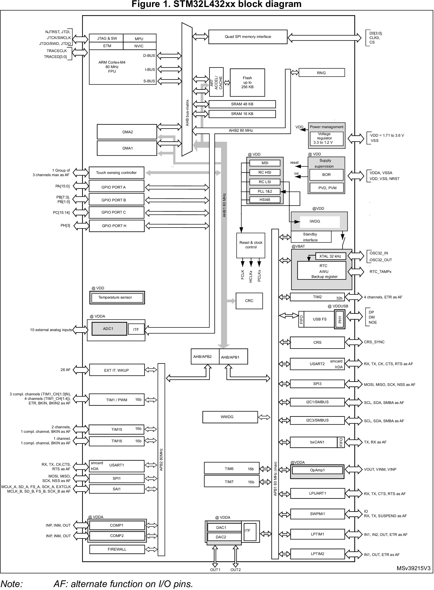

# Getting Started with STM32

---

  
Table of Contents

- [1 Intro to STM32](#1-intro-to-stm32)
- [2 The Nucleo Board](#2-the-nucleo-board)
    - [2.1 Nucleo-L432KC Pinout](#21-nucleo-l432kc-pinout)
    - [2.2 STM32L432KC Block Diagram](#22-stm32l432kc-block-diagram)
- [3 Developing Software for STM32](#3-developing-software-for-stm32)
    - [3.1 GitHub Version Control](#31-github-version-control)
    - [3.2 Integrated Development Environment](#32-integrated-development-environment)
- [4 Example Beginner Projects](#4-example-beginner-projects)
    - [4.1 Hello World: Onboard GPIO LED Blinking](#41-hello-world-onboard-gpio-led-blinking)
    - [4.2 First Input: GPIO Push Button Input](#42-first-input-gpio-push-button-input)
    - [4.3 Debug Expansion with Analog: Reading ADC with the Debugger](#43-debug-expansion-with-analog-reading-adc-with-the-debugger)
    - [4.4 Always Reading: ADC with DMA](#44-always-reading-adc-with-dma)
    - [4.5 Reactive system: NVIC](#45-reactive-system-nvic)
    - [4.6 Basic Communication: Arduino to STM32 USART](#46-basic-communication-arduino-to-stm32-usart)
    - [4.7 Not Brainless Design: Scheduler](#47-not-brainless-design-scheduler)
    - [4.8 Advanced Communications: CAN Messaging](#48-advanced-communications-can-messaging)

---

## 1 Intro to STM32

Getting started with STM32 microcontrollers for FSAE applications presents a
step up from platforms like Arduino, offering more advanced features and
capabilities. While these microcontrollers share similar programming concepts
with Arduino, they come with a steep learning curve to implement STM32s'
superior processing power and flexibility.

The STM32 is a family of 32-bit microcontrollers based on ARM Cortex-M
processors, developed by STMicroelectronics. What sets it apart from other
microcontrollers, like those in the Arduino series, is its advanced features:
STM32 offers higher processing power, greater memory capacity, and more
peripherals, like built-in USB controllers, ADCs (analog-to-digital converters),
and communication interfaces.

---

## 2 The Nucleo Board

STM32 Nucleo boards are a series of development boards designed around the STM32
microcontrollers. These boards come in different sizes, mirroring the STM32
microcontroller's diversity:

- Nucleo-32 (compact size).
- Nucleo-64 (medium size).
- Nucleo-144 (largest with advanced features and connectivity).

Examples include the Nucleo-F401RE for high-performance applications,
Nucleo-L432KC for power-efficient designs, and Nucleo-G071RB for general-purpose
use. Similar to Arduino boards in user-friendliness and community support, STM32
Nucleo boards are also Arduino-compatible, allowing them to use existing Arduino
shields, which makes them accessible for Arduino enthusiasts looking to upgrade
to more powerful and feature-rich microcontrollers.

Our department currently uses the
**[Nucleo-L432KC](https://www.st.com/en/evaluation-tools/nucleo-l432kc.html)**
as our primary development Nucleo. The primary reasons are:

1. CAN support.
2. Variety of peripherals.
3. Hits all the bare minimum needed specs.
4. Small form factor & wide PCB hat board availability.

### 2.1 Nucleo-L432KC Pinout

- Pictures from [os.mbed.com](https://os.mbed.com/platforms/ST-Nucleo-L432KC/)

Notice that the board uses Arduino style connector names (A0, D1, ...). When
actually programming all pin references will be to the MCU pin (PA_1,
PB_3, ...). The first "PA" of PA_1 means peripheral port A and "1" means pin 1.

### 2.2 STM32L432KC Block Diagram

Block diagrams are a simplified graphical representation of a system, breaking
down complex structures into individual components connected by lines that
indicate relationships or flows. They depict the functional workings of a
system, highlighting how different parts interact without delving into detailed
specifics. Similar to flowcharts, block diagrams are essential for
conceptualizing, designing, and troubleshooting systems.

- Picture
  from [ST STM32L432KC Datasheet](https://www.st.com/resource/en/datasheet/stm32l432kc.pdf).

---

## 3 Developing Software for STM32

### 3.1 GitHub Version Control

[nucleol432kc_template](https://github.com/OntarioTechRacing/nucleol432kc_template).

### 3.2 Integrated Development Environment

- Recommended for
  beginners: [stm32_cubeide_setup.md](../../devenvs/stm32_cubeide_setup.md).
- Advanced: [stm32_clion_setup.md](../../devenvs/stm32_clion_setup.md).

---

## 4 Example Beginner Projects

---

  
4.1 GPIO Output

### 4.1 Hello World: Onboard GPIO LED Blinking

The typical hello world project for embedded systems is to get a blinking LED
going. In this module we will work to get an LED that is already included on
Nucleo boards running.

**Materials:**

- Nucleo-L432KC.
- Programming cable (USB micro B).
- Your computer (this will be assumed going forwards).

**Additional Resources:**

- [stm32_gpio.md](peripherals/stm32_gpio.md)

**Starting Steps:**

1. Pick an LED that you want to get blinking.
2. Figure out which MCU pin you need to use.
    - Take a look at the Nucleo datasheet and
      the [pinout](#21-nucleo-l432kc-pinout).
3. Create a new project for the Nucleo-L432KC.
4. Find the main while loop.
5. Follow the additional resources to see code snippets.

---

  
4.2 GPIO Input

### 4.2 First Input: GPIO Push Button Input

Now that we've figure out how to output with GPIO, Let's try getting an input.
We'll use a simple button or switch to generate an input. Further we can an LED
turn on or off with the push of the button.

**Materials:**

- Nucleo-L432KC.
- Programming cable (USB micro B).
- Push button or switch.
- Breadboard.
- General hookup wire or jumper wires.

**Additional Resources:**

- [stm32_gpio.md](peripherals/stm32_gpio.md)

**Starting Steps:**

1. Pick an LED that you want to get blinking.
2. Figure out which MCU pin you need to use for LED output and one for GPIO
   input.
    - Take a look at the Nucleo datasheet and
      the [pinout](#21-nucleo-l432kc-pinout).
3. Wire the breadboard to accept the input of the button or switch.
4. Follow the additional resources to see code snippets.

---

  
4.3 ADC + Debugger

### 4.3 Debug Expansion with Analog: Reading ADC with the Debugger

GPIO as discussed is about digital values, the other side is analog values. In
this module the goal is to read analog values and display them using a debugger
in your IDE.

**Materials:**

- Nucleo-L432KC.
- Programming cable (USB micro B).
- Potentiometer.
- Breadboard.
- General hookup wire or jumper wires.

**Additional Resources:**

- [stm32_adc.md](peripherals/stm32_adc.md).

**Starting Steps:**

1. Figure out which MCU pin you need to use for ADC input.
    - Take a look at the Nucleo datasheet and
      the [pinout](#21-nucleo-l432kc-pinout).
2. Wire the breadboard to accept the input of the potentiometer.
3. Follow the additional resources to see code snippets.

---

  
4.4 ADC + DMA

### 4.4 Always Reading: ADC with DMA

Calling the HAL to get the ADC value everytime can be code complex and take up
unnecessary resources. DMA allows for constant updating of values to at the
hardware level, reducing resource use.

**Materials:**

- Nucleo-L432KC.
- Programming cable (USB micro B).
- Potentiometer.
- Breadboard.
- General hookup wire or jumper wires.

**Additional Resources:**

- [stm32_dma.md](peripherals/stm32_dma.md)

**Starting Steps:**

1. Based on the previous module's work, change the code to implement DMA to get
   the ADC value.

---

  
4.5 NVIC with GPIO Input

### 4.5 Reactive system: NVIC

In the previous GPIO Input module, we needed to poll every so often to check if
a button was pressed. Instead, we can use interrupts.

**Materials:**

- Nucleo-L432KC.
- Programming cable (USB micro B).
- Push button or switch.
- Breadboard.
- General hookup wire or jumper wires.

**Starting Steps:**

1. Based on the previous module's work with GPIO inputs, change the code to use
   the NVIC to turn an LED on and off.

---

  
4.6 USART

### 4.6 Basic Communication: Arduino to STM32 USART

**Dev Envs:**

- [arduino_prototyping.md](../../devenvs/arduino_prototyping.md).

---

  
4.7 Scheduler

### 4.7 Not Brainless Design: Scheduler

**Additional Resources:**

- [stm32_scheduler.md](core/stm32_scheduler.md).
- [stm32_clocks.md](core/stm32_clocks.md).

---

  
4.8 CAN

### 4.8 Advanced Communications: CAN

**Additional Resources:**

- [stm32_can_bus.md](peripherals/stm32_can_bus.md).

**Dev Envs:**

- [can_bus_dev_tools.md](../../devenvs/can_bus_dev_tools.md).

